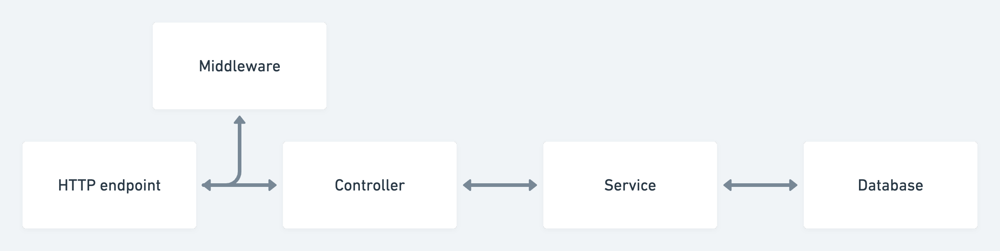
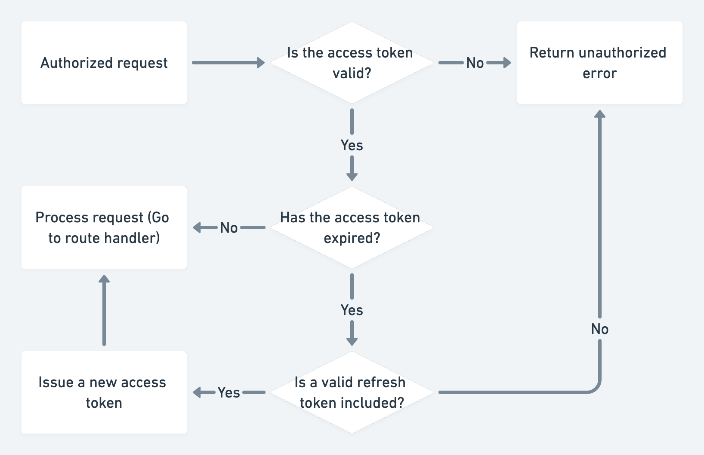

# Build a REST API with Node.js, Mongoose & TypeScript

Note: This repository includes the [postman collection for the finished API](postman_collection.json)

## Common issues
* I'm getting a JWT malformed error: https://youtu.be/FzKrfwplips

## Who is this tutorial for?
* Junior to mid-level developers
* Anyone interested in building REST APIs with TypeScript

## What you will need
* A running instance of MongoDB
* Postman
* An IDE or text editor (VS Code)
* A web browser
* A package manager such as NPM or Yarn
* Node.js installed

## What next?
* Testing the API with Jest
* Build a React.js user interface
* Add Prometheus metrics to the API
* Deploy the API with Caddy & Docker
* Add Google OAuth

## Concepts
* REST API principals
    * CRUD
    * HTTP methods
* JWT & refresh tokens
* Request validation
## Technologies
* Node.js
* MongoDB with Mongoose
* TypeScript
* Express.js & Express.js middleware
* Zod validation

## Video structure
1. What are we going to build (Postman demo)
2. Code walk-through
3. Bootstrap application
   1. Setup express JS
   2. Create routes function
   3. Setup database connection
   4. Setup logger
   5. Validate request middleware
4. Registration
   1. Create user model
   2. Create user endpoint
   3. Create user session
   4. Deserialize user middleware (refresh tokens)
   5. Get sessions
   6. Delete session
   7. Require user middleware
5. Product resource
   1. Create product model
   2. Create product
   3. Read product
   4. Update product
   5. Delete product

## Data flow

## Access & refresh token flow

## Let's keep in touch
- [Subscribe on YouTube](https://www.youtube.com/TomDoesTech)
- [Discord](https://discord.gg/4ae2Esm6P7)
- [Twitter](https://twitter.com/tomdoes_tech)
- [TikTok](https://www.tiktok.com/@tomdoestech)
- [Facebook](https://www.facebook.com/tomdoestech)
- [Instagram](https://www.instagram.com/tomdoestech)

[Buy me a Coffee](https://www.buymeacoffee.com/tomn)

[Sign up to DigitalOcean 💖](https://m.do.co/c/1b74cb8c56f4)
